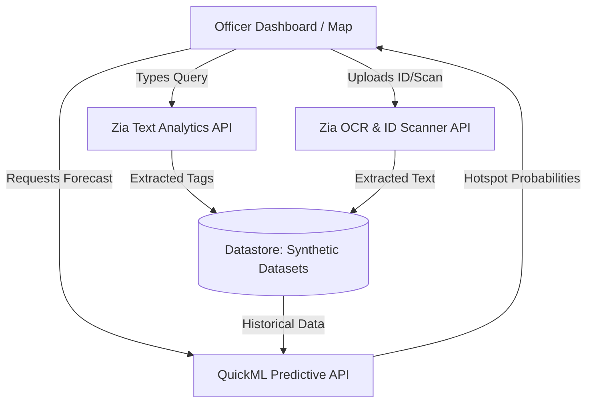

# Zoho Catalyst API: Project Use Case Mapping

Based on the scopes granted by your API token (`ZohoCatalyst.mlkit.READ` and `QuickML.deployment.READ`), here is exactly how we can leverage these out-of-the-box Catalyst APIs for the **KSP Sentinel** Datathon project.

By using these native APIs, we avoid building ML models from scratch, which will drastically speed up our prototype development.

---

## 1. Zia Text Intelligence (MLKit)

**What it does:** Extracts structured meaning (Sentiment, Named Entities, Keywords) from raw text.

### Use Case A: Automated Investigative Assist (The Chatbot)
- **Problem Statement Goal:** Build a natural language query interface.
- **How we use Zia:** When an officer types, *"Show me all chain snatching cases near Cubbon Park involving a two-wheeler,"* we send this text to the **Zia Named Entity Recognition (NER)** API. 
- **The Result:** Zia automatically extracts:
  - `Crime_Type`: Chain Snatching
  - `Location`: Cubbon Park
  - `Keyword`: Two-wheeler
- We then use these structured tags to filter the `synthetic_fir_text.csv` database perfectly, without needing complex SQL queries.

### Use Case B: Automated FIR Tagging
- **How we use Zia:** When a new FIR is filed, we pass the raw Modus Operandi text to the **Zia Keyword Extraction** API. It automatically generates searchable hashtags (e.g., `#Knife`, `#NightTime`, `#SingleOccupant`) to enrich the database.

---

## 2. QuickML Predictive Endpoints (Auto ML)

**What it does:** Serves predictions from custom tabular machine learning models trained on Catalyst.

### Use Case C: Predictive Policing & Hotspots
- **Problem Statement Goal:** Predict where crimes are likely to happen next based on historical data.
- **How we use QuickML:** We upload our `synthetic_station_crimes.csv` to Catalyst QuickML to train a Random Forest model. 
- **The API Call:** The frontend Dashboard sends current data (e.g., `Date: Friday, Time: Night, District: Mysuru City`) to the QuickML endpoint.
- **The Result:** The API returns a prediction score (e.g., `85% probability of Robbery`). The frontend uses this score to turn the Mysuru City zone **RED** on the map.

---

## 3. Zia Computer Vision & OCR (MLKit)

**What it does:** Extracts text from images and analyzes visual content.

### Use Case D: Legacy FIR Digitization
- **Problem Statement Goal:** Automated Crime Data Ingestion.
- **How we use Zia OCR:** Police stations have decades of old, scanned PDF case files. Instead of manual data entry, an officer uploads the scanned image to our app. The **Zia OCR API** converts the image into searchable text, which is then fed into the database.

### Use Case E: Accused Identity Verification
- **How we use Zia Identity Scanner:** When booking a suspect, an officer uploads a photo of an Aadhaar or PAN card. The **Zia e-KYC API** immediately extracts the Name, DOB, and ID number to cross-reference against our `synthetic_profiles.csv` recidivist (repeat offender) database.

---

## Architecture Flow Summary

