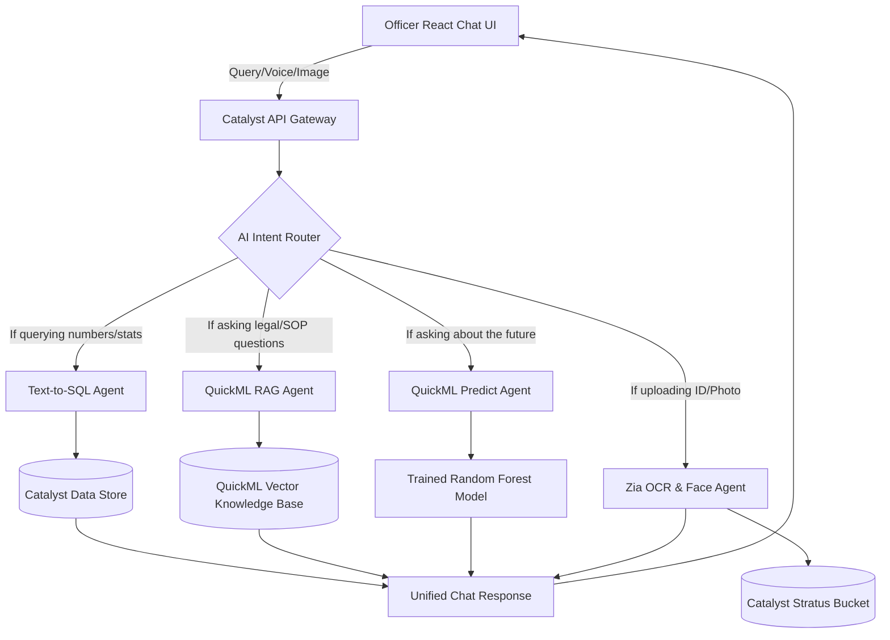

# The Ultimate KSP Sentinel AI Assistant
*A visionary architecture designed to wow the Datathon Judges and Police Department Clients.*

If we scrap the current basic implementation and build the **perfect** Investigative Chatbot natively on Zoho Catalyst, it wouldn't just be a Q&A tool—it would be a **Proactive AI Co-Investigator**. 

Here is exactly how I would design it to make the clients fall in love with the product:

---

## 1. The "Wow Factor" Features

### 🎙️ Multimodal & Multilingual Input (Zia Speech & Translation)
Police officers in the field don't always have time to type complex SQL-like queries.
- **Feature:** An officer can tap a microphone icon and speak in Kannada or English: *"Find all two-wheeler thefts in Malleswaram from last night."*
- **Execution:** We use the **Zia Speech-to-Text** API to transcribe the audio, and the **Zia Translation** API to convert Kannada to English before querying the database.

### 📸 Instant Suspect e-KYC (Zia Identity Scanner)
- **Feature:** An officer uploads a photo of a suspect's Aadhaar Card or PAN Card directly into the chat.
- **Execution:** The chatbot automatically triggers the **Zia Identity Scanner (OCR)**, extracts the Name and DOB, queries our `synthetic_profiles.csv` database, and instantly replies: *"This suspect has 3 prior offenses for burglary. Recidivist flag is HIGH."*

### ⚖️ Automated FIR Drafting & Legal Mapping (QuickML RAG)
- **Feature:** An officer types a rough summary: *"Suspect snatched a gold chain at knifepoint."*
- **Execution:** The chatbot uses our `synthetic_legal_statutes.csv` and RAG to automatically reply: *"This falls under BNS Section 309(4) (Robbery/Snatching). Punishment is up to 7 years. Would you like me to draft the formal FIR?"*

### 🗺️ Dynamic Map Generation in Chat
- **Feature:** When an officer asks for crime hotspots, the chatbot doesn't just return a text list. It returns an interactive mini-map right inside the chat window showing the exact Latitude/Longitude pinpoints.

---

## 2. The Agentic Pipeline Architecture

To achieve this, we wouldn't use a single "dumb" script. I would implement an **Agentic Router Architecture** hosted on Catalyst Serverless Functions.

---

## 3. Why Clients (and Judges) Will Love This

1. **Zero Learning Curve:** Officers don't need to learn how to use a complex dashboard filter or write SQL. They just talk to the app like they talk to a colleague.
2. **Time Savings:** Automating FIR drafting and ID verification cuts administrative desk work by hours per day, keeping officers on patrol.
3. **Proactive, Not Reactive:** Instead of just looking at historical graphs, the Chatbot uses QuickML to say, *"Based on this query, I noticed a 40% spike in this MO. I recommend increasing night patrols in Sector 4."*
4. **100% Native Zoho Catalyst:** By utilizing Zia OCR, Zia Translation, QuickML RAG, and Data Store, we demonstrate absolute mastery of the platform without relying on expensive external APIs like OpenAI or AWS.

---

> [!TIP]
> **Implementation Reality:** We can build a functioning prototype of this entire architecture in the remaining Datathon time because Catalyst provides all these modules (OCR, RAG, Translation, Serverless) out of the box!
